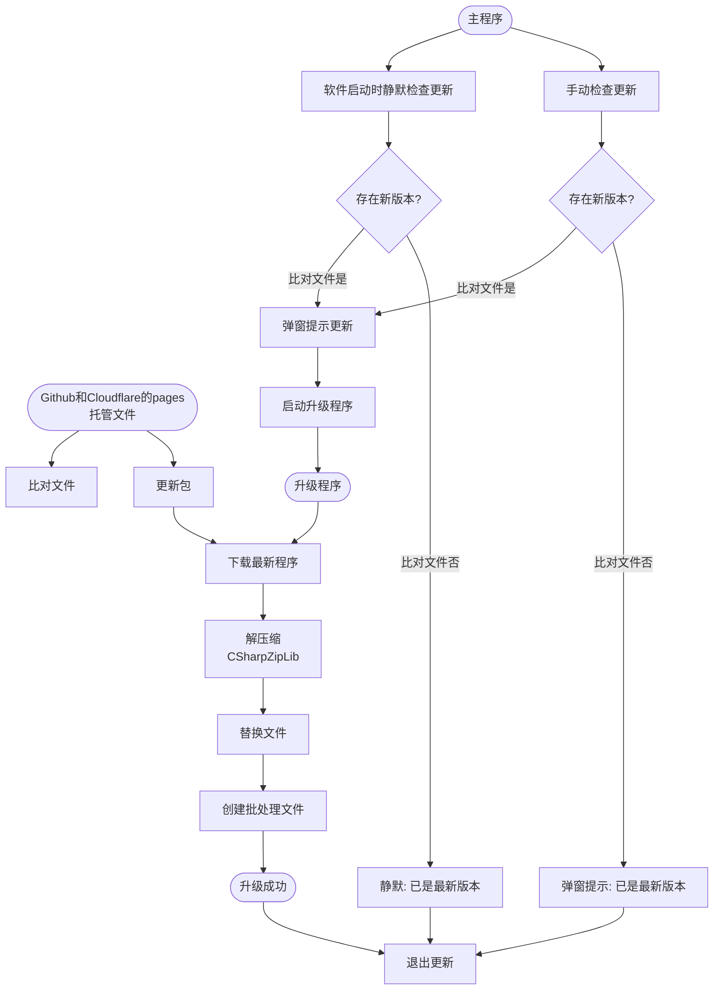

# CSharpUpdate
C#写的软件在线OTA升级Demo

本代码基于Visual Studio 2022和dotnet4.8编写的Winform程序，双击`UpdateTest.sln`即可运行。

可能需要手动获取`Nuget`包，因为使用了`ICSharpCode.SharpZipLib.dll`这个解压缩插件。

此软件通过与服务器的版本号比较，安装包也存放于服务器，这里的服务器使用的是`Github和Cloudflare`的Pages服务，个人使用免费。

大概思路如下：

更新：

1、支持解压密码；

2、当检测到远端的版本号为0.0.0则删除所有文件。

